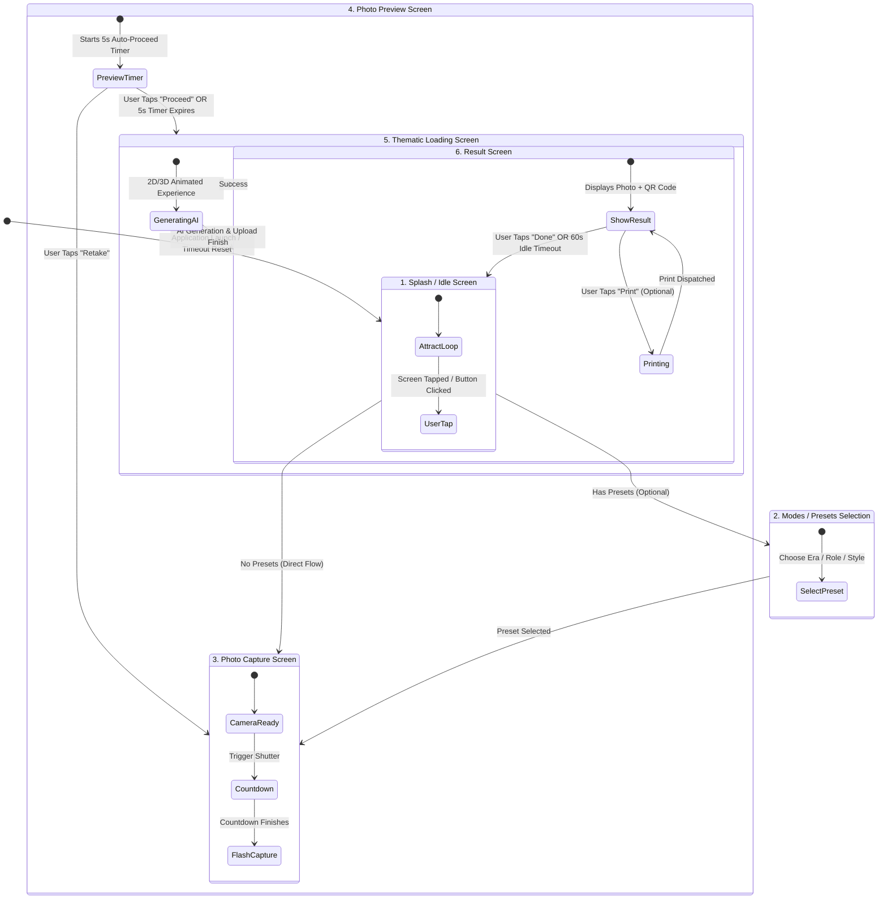

# Photobooth Screen Flow & Navigation Architecture

This skill defines the standardized screen navigation flow, state machine, and UI/UX design patterns for all 5DVR interactive photobooth kiosks. It separates **universal shared screens** (present in every photobooth) from **modular/project-specific screens** (present only when required by the activation theme).

---

## 1. Complete Screen Flow State Machine



---

## 2. Screen Specifications & Behavioral Rules

### Screen 1: Splash / Idle (Attract) Screen
- **Scope**: **Shared** across all photobooth projects.
- **Purpose**: Attract exhibition attendees passing by the kiosk.
- **Key UI Elements**:
  - Event / brand title and striking visual typography.
  - Large pulsing "Tap to Start" or "Touch Screen" call-to-action button.
  - Ambient background animation (looping particle canvas, subtle Three.js backdrop, or themed video).
  - Audio attractor (optional, muted by default).
- **Behavior**:
  - Tapping anywhere or clicking the CTA transitions to **Screen 2** (if presets exist) or directly to **Screen 3** (if single theme).
  - All temporary state, face data, and previously generated images are reset here.

---

### Screen 2: Eras / Modes / Presets Selection Screen
- **Scope**: **Project-Specific / Optional** (Only included if the activation offers multiple eras, career roles, themes, or styles).
- **Purpose**: Allows participants to customize their AI transformation.
- **Key UI Elements**:
  - Grid or interactive carousel of preset cards.
  - Visual thumbnail, title (e.g. "Industrial Engineer", "Space Explorer", "1920s Vintage"), and brief prompt hook.
  - Active selection indicator and "Continue" button.
- **Behavior**:
  - Tapping a card sets `selectedPreset` and advances to **Screen 3 (Capture)**.
  - Idle timeout (e.g., 30s of inactivity) resets back to **Screen 1 (Splash)**.

---

### Screen 3: Photo Capture Screen
- **Scope**: **Shared** across all photobooth projects.
- **Purpose**: Live camera framing, countdown, and photo capture.
- **Key UI Elements**:
  - Full-screen or bordered high-definition camera viewport (`<video>` / WebRTC stream).
  - Face alignment guide (subtle oval/frame HUD encouraging users to center their face).
  - Shutter trigger button.
  - **Animated 2D or 3D Countdown UI**:
    - 3-2-1 countdown with scaling numbers, radial gauge fill, or Three.js particle vortex.
    - Sound effect beeps on 3-2-1 and shutter sound on 0.
- **Behavior**:
  - When countdown reaches 0:
    1. Draw frame to hidden `<canvas>`.
    2. Extract Base64 JPEG data URL (`canvas.toDataURL('image/jpeg', 0.95)`).
    3. Concurrently kick off client-side face detection (`detectFaces`) so landmarks/gender are ready.
    4. Immediately transition to **Screen 4 (Preview)**.

---

### Screen 4: Photo Preview Screen (With Auto-Proceed)
- **Scope**: **Shared** across all photobooth projects.
- **Purpose**: Confirms participant satisfaction while preventing kiosk bottlenecks.
- **Key UI Elements**:
  - Full preview of captured still image.
  - "Retake Photo" button (re-opens camera capture).
  - "Looks Great / Proceed" button.
  - **Visual Countdown Progress Bar / Ring**: Displays the auto-proceed timer countdown.
- **Behavior & Strict Auto-Proceed Rule**:
  - **Auto-Proceed Timer**: When the screen mounts, start a **5-second countdown timer** (configurable between 4–7 seconds).
  - **User Actions**:
    - If the user taps **"Retake"**: Clear the timer immediately and navigate back to **Screen 3 (Capture)**.
    - If the user taps **"Proceed"**: Clear the timer and navigate to **Screen 5 (Loading)**.
    - **If the timer expires with NO user interaction**: Automatically trigger "Proceed" and advance to **Screen 5 (Loading)**.
  - *Why this is mandatory*: In crowded exhibitions, attendees often step back and look at the screen without touching it. The auto-proceed timer ensures the queue never gets blocked.

---

### Screen 5: Thematic Loading Screen (Impressive 2D / 3D)
- **Scope**: **Shared Structure** with project-specific theme styling.
- **Purpose**: Entertains attendees during AI image synthesis (typically 8–15 seconds).
- **Key UI Elements**:
  - **High-Impact Animated Experience**:
    - **3D Three.js Canvas**: Holographic scanner beams, quantum particle cloud, futuristic wireframe model assembly, cyber matrix portals.
    - **2D Canvas / CSS**: Cyber HUD radar sweeps, pulsing energy rings, dynamic glow effects.
  - **Dynamic Status Messages**: Rotates through informative progress milestones:
    - `"Analyzing facial features..."` (0-3s)
    - `"Synthesizing custom attire & environment..."` (3-8s)
    - `"Harmonizing lighting & shadows..."` (8-12s)
    - `"Finalizing high-resolution output..."` (12s+)
  - Animated progress bar or percentage counter (simulated smooth easing up to 92%, then jumps to 100% on API return).
- **Behavior**:
  - Calls AI generation API (`generateImage`) and Cloudinary upload in parallel or sequence.
  - Fires the photo count increment API (`incrementGeneratedCount`).
  - On API success, transitions directly to **Screen 6 (Result)**.
  - On failure, displays graceful retry prompt or falls back to an error recovery dialog.

---

### Screen 6: Result Screen
- **Scope**: **Shared** across all photobooth projects.
- **Purpose**: Delivers the final artwork, QR sharing, and physical printing.
- **Key UI Elements**:
  - Prominent display of the final transformed photo (with optional event branding overlay/frame).
  - **High-Resolution QR Code**: Pointing to the mobile photobooth viewer (`https://photobooth-viewer.vercel.app/?url=...&branded=true`).
  - "Scan with Phone Camera to Download" instructions.
  - **Action Buttons**:
    - `"New Photo / Finish"` (Cleans up state and returns to **Screen 1**).
    - `"Print Photo"` (Optional: only visible if photo printing is enabled for this project).
  - Visual Auto-Reset Countdown (e.g. 60–90 seconds circular indicator).
- **Behavior**:
  - If "Print" is clicked: sends silent print job to Electron via IPC, displays "Printing in progress..." toast, and disables print button to prevent duplicate waste.
  - If user taps "Finish" or the idle timer reaches 0: resets all state and returns to **Screen 1 (Splash)**.

---

## 3. UI/UX Clarification Protocol

> [!IMPORTANT]
> **Always Clarify Underspecified UI/UX**:
> Before building or finalizing screens, **ask the user** if any of the following are ambiguous:
> 1. **Visual Theme**: Colors, font families, branding identity (e.g., Cyberpunk, Retro Historical, Sleek Corporate, Luxury Gold, Industrial).
> 2. **2D vs. 3D Requirements**: Does the client want lightweight 2D animations (CSS/Lucide/Canvas) or an impressive 3D Three.js visual (particles, 3D models, shader rings)?
> 3. **Modes / Presets Screen**: Does the booth have selectable modes/eras, or is it a single unified experience?
> 4. **Printing**: Will there be a connected dye-sub printer (Canon Selphy, DNP), or is it digital QR only?
> 5. **Preview Timer**: Confirm the auto-proceed duration (standard is 5 seconds).

---

## 4. 3D Three.js Integration Standards

When the user requests **3D graphics** for the Splash, Countdown, or Loading screens:

1. **Stack**:
   ```bash
   npm install three @types/three @react-three/fiber @react-three/drei
   ```
2. **Kiosk GPU Optimization**:
   - Limit particle count to `1,000 – 3,000` points on integrated kiosk GPUs (Intel Iris / AMD Vega) to maintain solid 60 FPS.
   - Disable antialiasing on low-spec hardware: `<Canvas gl={{ antialias: false, powerPreference: 'high-performance' }}>`.
   - Always cancel `requestAnimationFrame` loops and dispose geometries/materials upon screen unmount to prevent WebGL context loss errors (`WEBGL_lose_context`).

---

## 5. TypeScript State Machine Implementation

```typescript
export type PhotoboothScreen = 
  | 'splash'
  | 'preset_selection'
  | 'capture'
  | 'preview'
  | 'loading'
  | 'result';

export interface PhotoboothFlowConfig {
  hasPresetsScreen: boolean;
  previewAutoProceedSeconds: number; // Default: 5
  resultScreenIdleTimeoutSeconds: number; // Default: 60
  hasPrinting: boolean;
}
```
